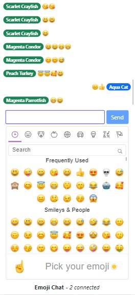

# Emoji Chat App Using Socket.io and Emoji Mart

Simple emoji chat React.js app using socket.io frameworks. API folder is a simple server generating user names automatically and store chat history in lru cache (deletes the least recently used history). Multiple users can share emojis simultaneously supported from Emoji Mart framework.

## Frameworks

### Server Side (api)

LRU Cache 

`const cache = new LRU({ max: 50, maxAge: 1000 * 60 * 60 });`

Unique name generator 
`const randomName = uniqueNameGenerator({ dictionaries: [colors, animals] });`

Socket.io 
`const app = require('express');` 
`const server = require('http').createServer(app);` 
`const io = require('socket.io)(server)` 
`io.on('connection', () => { /* code */ });` 
`server.listen(3000);`

### Client Side (web)

Client socket.io, React Bootstrap, Emoji Mart

`import 'emoji-mart/css/emoji-mart.css';` 
`import { Picker } from 'emoji-mart';` 
`<Picker set='apple' />` 
`<Picker title='Pick your emoji' emoji='point_up' />`  

useRef Hook returns a mutable ref object whose `.current` property is initialized to the passed argument. The returned object will persist for the full lifetime of the component. 
`let socketRef = useRef();` 
`socketRef.current = SocketIOClient(http://localhost:5000);` 
`socketRef.current.on('message', (message) => {` 
&nbsp;&nbsp;&nbsp;&nbsp;`setMessages(messages => [...messages, message]);` 
`});` 
